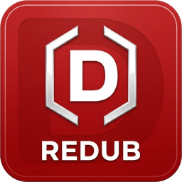

# Redub - Dub Based Build System
[](https://github.com/MrcSnm/redub/actions/workflows/ci.yml)

## Redub for dub users
- Change directory to the project you want to build and enter in terminal `dub run redub`
  > To fully take advantage of redub speed, you might as well use redub directly.

## Building redub
- Enter in terminal and execute [`dub`](https://github.com/dlang/dub)
- Highly recommended that you build it with `dub build -b release-debug --compiler=ldc2` since this will also improve its speed on dependency resolution


# Redub Additions
Those are the additions I've made over dub
- **Self Update**: `redub update` will either sync to the latest repo (and build it) or replace it with latest release
- [**Compiler Management**](#compiler-management) - Support to change default compiler and install on command line
- [**Redub Plugins**](#redub-plugins) - Alternative to rdmd. Execute arbitrary D code in the build steps.
- [**Multi Language**](#multi-language) - Compile a C project together and include it on the linking step
- [**Executable Icons**](#redub-executable-icons) - Include an icon in your .exe by simply defining the images on your recipe. 
- [**MacOS Bundle**](#macos-bundle) - Redub can also generate .app for your macOS builds.
- [**Library API**](#using-its-library-api) - Integrate redub directly in your application
- **Watching Directories** - `redub watch`- Builds dependents automatically on changes. Add  `--run` to run the program after building.
- **MacOS Universal Builds** - `redub build-universal` - Generates a single binary containing arm64 and x86_64 architectures on MacOS
- [**Redub Executable Icons**](#redub-executable-icons) - Adds inside the recipe file a way to define how your program icon will look
- [**Linker Diagnostics**](#redub-linker-diagnostics) - Experimental support to improve linker message errors.
- [**Cross Compilation Targets**](#redub-cross-compile) - Adds support to build targets, selecting a compiler, architecture and other configuration by just calling `redub --target=PSVita`


## Redub Help
- [Original Dub Documentation](https://dub.pm/)
- You may also get help by running `dub run redub -- --help` or simply `redub --help`


## Compiler Management
- Installing new compilers, use `redub install`:
  ```
  redub install requires 1 additional argument:
          opend: installs opend
          ldc <version?|help>: installs ldc latest if version is unspecified.
                  help: Lists available ldc versions
          dmd <version?>: installs the dmd with the version 2.111.0 if version is unspecified
  ```
- Using the new compilers, use `redub use` - Redub use will also install if you don't already have it:
  ```
  redub use requires 1 additional argument:
        opend <dmd|ldc>: uses the wanted opend compiler as the default
        ldc <version?>: uses the latest ldc latest if version is unspecified.
        dmd <version?>: uses the 2.111.0 dmd if the version is unspecified.
        reset: removes the default compiler and redub will set it again by the first one found in the PATH environment variable
  ```


## Redub Plugins

Redub has now new additions, starting from v1.14.0. Those are called **plugins**.
For using it, on the JSON, you **must** specify first the plugins that are usable. For doing that, you need to add:

```json
"plugins": {
  "getmodules": "C:\\Users\\Hipreme\\redub\\plugins\\getmodules"
}
```

That line will both build that project and load it inside the registered plugins (That means the same name can't be specified twice)

The path may be either a .d module or a dub project
> WARNING: This may be a subject of change and may also only support redub projects in the future, since that may only complicate code with a really low gain

Redub will start distributing some build plugins in the future. Currently, getmodules plugins is inside this repo as an example only but may be better used.
Only preBuild is currently supported since I haven't found situations yet to other cases.
For it to be considered a redub plugin to be built, that is the minimal code:

```d
module getmodules;
import redub.plugin.api;

class GetModulePlugin : RedubPlugin {}
mixin PluginEntrypoint!(GetModulePlugin);
```

For using it on prebuild, you simply specify the module and its arguments:
```json
"preBuildPlugins": {
  "getmodules": ["source/imports.txt"]
}
```

**Useful links regarding plugins:**
- [**GetModule plugin**](./plugins/getmodules/source/getmodules.d)
- [**Example Usage**](./tests/plugin_test/dub.json)

## Redub Executable Icons

- **v1.27.4**: Added Windows support

Specify one or more .png paths to your icon (only .png is supported), and it will be the icon of your project. This feature is already in use on redub itself.
```json
"icon": [
  "logo.png",
  "logo16.png"
]
```
The first icon path is where redub will output the .res

## MacOS Bundle

- **1.28.0**: Added --bundle=macos support

This feature was first supposed to add icons to apple applications, but macOS relies on you distributing bundles. You can use the icons in the same way mentioned above. Just use `redub build --bundle=macos` and it will generate a complete macOS bundle for you instead of the raw terminal one.

## Linux AppImages
- **v1.28.2** -- Added --bundle=linux support

This feature provides building AppImages to Linux. This is only supported running on linux, if no icon is provided, it will use the following icon:

  

You can also control the bundle configurations by using. Failing to use a valid category will show all available categories.
```json
"bundleConfiguration": {
  "categories": [
    "Game"
  ],
  "terminal": false //Control whether the terminal should show up
}
```


## Redub Linker Diagnostics
- **1.29.0**: Added Windows Linker Diagnostics.

Sometimes people may get cryptic error messages regarding anundefined __ModuleInitZ symbol. Since Redub already had information on how each module imports each other, I've ended up adding support to improve the linker messages as that may reduce by a lot iteration time. Example:

```
hipreme_engine.obj : error LNK2001: unresolved external symbol _D3hip3api12__ModuleInfoZ
C:\Users\Hipreme\AppData\Local\.dub\.redub\1AB9D53797DC3516\1AB9D53797DC3516\hipreme_engine.exe : fatal error LNK1120: 1 unresolved external symbol
Error: C:\Program Files (x86)\Microsoft Visual Studio\2022\BuildTools\VC\Tools\MSVC\14.44.35207\bin\HostX64\x64\link.exe failed
with status: 1120
```
This gets one additional message

```
Redub Help Message: Module hip.api is imported by:
        hip.view.load_scene (C:\Users\Hipreme\Documents\D\HipremeEngine\source\hip\view\load_scene.d)
```

## Redub Cross Compile
- **1.30.0**: Added cross compilation definition support via the `--target` flag.

Ever wanted to configure a default compiler/arch based on the configuration? Now you can (mostly). This is an example on how a `target` will look in your recipe JSON:

```json
{
  "name": "my-project",
  "targets": {
    "wasm": {
      "compiler": "ldc2",
      "arch": "wasm32-unknown-unknown-wasm"
    },
    "PSVita": {
      "compiler": "ldc2",
      "arch": "armv7a-unknown-unknown-eabi",
      "dflags": [
        "--revert=dtorfields",
        "-mcpu=cortex-a9",
        "-mattr=+neon,+neonfp,+thumb-mode",
        "-fvisibility=hidden",
        "-gcc=$VITASDK/bin/arm-vita-eabi-gcc",
        "--relocation-model=static"
      ],
      "versions": ["PSVita"],
      "dependencies": {
        "custom-rt": {"path": "my/custom/runtime"}
      },
      "runCommand": ["nxlink", "${DUB_ROOT_PACKAGE}.nro"] //New addition to redub. If you're cross-compiling, you can define a specific run command that will be used instead of just launching from shell the executable.
    }
  }
}
```
Now you can just call `redub --target=wasm` or `redub --target=PSVita` and every dependency will inherit this configuration.

## Multi language

Redub has also an experimental support for building and linking C/C++ code together with D code. For that, you need to define a dub.json:
```json
{
  "language": "C"
}
```

## Using its library API

The usage of the library APIispretty straightforward. You get mainly 2 functions
1. `resolveDependencies` which will parse the project and its dependencies, after that, you got all the project information
2. `buildProject` which will get the project information and build in parallel

```d
import redub.api;
import redub.logging;

void main()
{
  import std.file;
  //Enables logging on redub
  setLogLevel(LogLevel.verbose);

  //Gets the project information
  ProjectDetails d = resolveDependencies(
    invalidateCache: false,
    std.system.os,
    CompilationDetails("dmd", "arch not yet implemented", "dmd v[2.105.0]"),
    ProjectToParse("configuration", getcwd(), "subPackage", "path/to/dub/recipe.json (optional)")
  );

  /** Optionally, you can change some project information by accessing the details.tree (a ProjectNode), from there, you can freely modify the BuildRequirements of the project
  * d.tree.requirements.cfg.outputDirectory = "some/path";
  * d.tree.requirements.cfg.dFlags~= "-gc";
  */

  //Execute the build process
  buildProject(d);
}
```


With that, you'll be able to specify that your dependency is a C/C++ dependency. then, you'll be able to build it by calling `redub --cc=gcc`. You can also
specify both D and C at the same time `redub --cc=gcc --dc=dmd`. Which will use DMD to build D and GCC to C.

You can see that in the example project: [**Multi Language Redub Project**](./tests/multi_lang/dub.json)


[**Project Meta**](META.md)